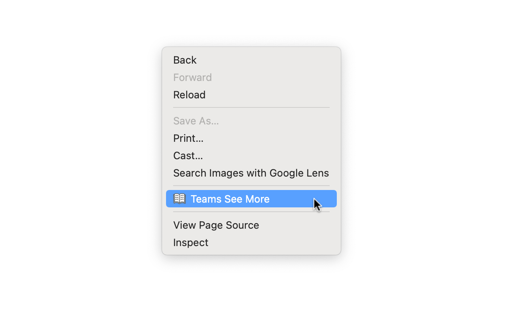

# 🚀 Teams See More

This is a browser extension that expands collapsed messages in Microsoft Teams Web.

## How to install

You can install from your browser extension store below.

- [Chrome / Brave](https://chrome.google.com/webstore/detail/teams-see-more/ndnacjlajgpdeahkcooiilheddiabjdc)
- [Firefox](https://addons.mozilla.org/ja/firefox/addon/teams-see-more/)
- [Edge](https://microsoftedge.microsoft.com/addons/detail/teams-see-more/jnghkkghondopbbnnclkbcnapfchiiea)

## Usage

1. Show the context menu (normally right click) on Microsoft Teams Web.
1. Select "Teams See More" from the context menu.
1. The collapsed messages will be expanded.
